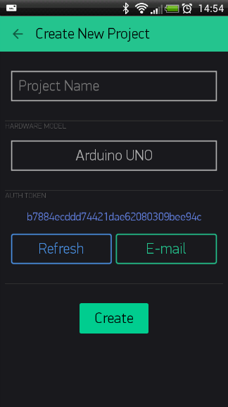
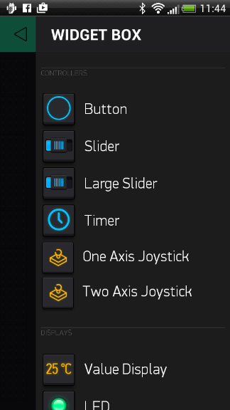
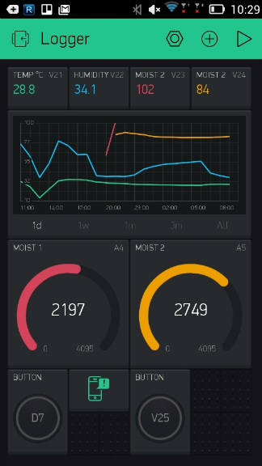
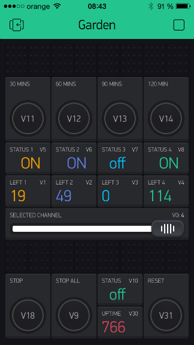
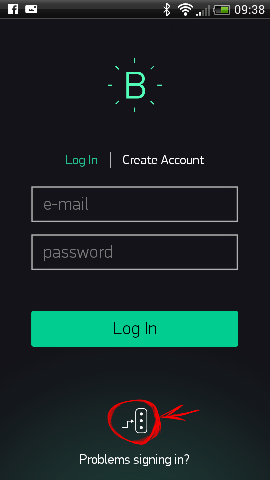
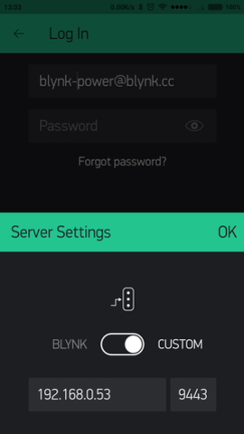
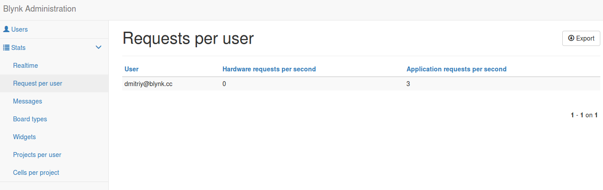

# Este não é o fonte original do servidor Blynk Legacy
Este é uma cópia de https://github.com/Peterkn2001/blynk-server.
O repositório do servidor Blynk Legacy foi removido há algum tempo. Eu clonei este porque tenho o servidor rodando localmente em minha casa, então tenho uma dependência dele. O servidor Blynk Legacy foi descontinuado e não há mais suporte. Portanto enconrajo você fortemente a usar o novo e oficial [Blynk IOT](https://blynk.io/).
As versões lançadas aqui serão apenas atualização tradução dos manuais para pt-BR, correções de bugs e pequenas implementações sem nenhuma garantia ou suporte, use por sua conta e risco!!!

### Observe que o servidor Blynk Legacy foi descontinuado e não há mais suporte!
Ele não funciona com o aplicativo Blynk mais recente, e o aplicativo legado foi retirado das lojas de aplicativos app/play stores a partir de 30 de junho de 2022. Os aplicativos instalados anteriormente continuarão funcionando, embora versões posteriores do aplicativo legado não tenham a capacidade de criar novas contas, portanto, será necessária uma versão anterior do aplicativo ou a conta precisará ser criada manualmente, copiando e renomeando a conta Blynk.cc padrão.

Os servidores em nuvem legados foram desativados em 31 de dezembro de 2022. Isso não terá impacto nos servidores legados locais, mas como todo o suporte e atualizações para este servidor local legado e os aplicativos legados já cessaram, o uso de um servidor legado local deve ser considerado como medida provisória, porque o servidor eventualmente se tornará vulnerável quando o suporte para Java 11 for retirado e quando os aplicativos não funcionarem mais em versões mais recentes dos sistemas operacionais móveis.

A instalação do aplicativo iOS depois de retirado da app store exigirá o jailbraking do dispositivo móvel da Apple, e os usuários do Android precisarão obter e carregar lateralmente uma cópia do aplicativo legado fora da playstore.

# O que é o Blynk?

Blynk é uma plataforma com aplicativos iOS e Android para controlar Arduino, ESP8266, Raspberry Pi e similares pela Internet.
Você pode construir facilmente interfaces gráficas para todos os seus projetos simplesmente arrastando e soltando widgets. 
Se precisar de mais informações, acesse estes links:
* [Site Blynk](https://www.blynk.io)
* [Documentos Blynk](http://docs.blynk.cc)
* [Comunidade Blynk](https://community.blynk.cc)
* [Gerador de Exemplos Blynk](https://examples.blynk.cc)
* [Facebook](http://www.fb.com/blynkapp)
* [Twitter](http://twitter.com/blynk_app)
* [Blynk Library](https://github.com/Josafa2018/blynk-library)
* [Kickstarter](https://www.kickstarter.com/projects/167134865/blynk-build-an-app-for-your-arduino-project-in-5-m/description)






# Conteúdo

- [Download](#servidor-blynk)
- [Requisitos](#requisitos)
- [Configuração Rápida do Servidor](#configuração-rápida-do-servidor)
- [Habilitando E-mail no Servidor](#habilitando-email-no-servidor)
- [Configuração Rápida do Servidor no Raspberry PI](#configuração-rápida-do-servidor-no-raspberry-pi)
- [Configuração do Contêiner Docker](#configuração-do-contêiner-docker)
- [Habilitando a Reinicialização Automática do Servidor em Sistemas Linux](#habilitando-a-reinicialização-automática-do-servidor-em-sistemas-linux)
- [Habilitando a Reinicialização Automática do Servidor no Windows](#habilitando-a-reinicialização-automática-do-servidor-no-windows)
- [Atualizando o Servidor em Sistemas Linux](#atualizando-o-servidor-em-sistemas-linux)
- [Atualizando o Servidor no Windows](#atualizando-o-servidor-no-windows)
- [Configurando App e sketch para Servidor](#configurando-app-e-sketch-para-servidor)
- [Configuração Avançada do Servidor](#configuração-avançada-do-servidor)
- [Interface de Administração do Usuário](#interface-de-administração-do-usuário)
- [API HTTP/S RESTful](#https-restful)
- [Habilitando Envio de SMS no Servidor](#habilitando-envio-de-sms-no-servidor)
- [Habilitando o armazenamento de dados raw](#habilitando-o-armazenamento-de-dados-raw)
- [Gerar Certificados Automáticos Let's Encrypt](#gerar-certificados-automáticos-lets-encrypt)
- [Gerar Certificados Manuais Let's Encrypt SSL/TLS](#gerar-certificados-manuais-lets-encrypt-ssltls)
- [Gerar Certificado Auto-Asssinado SSL](#gerar-certificado-auto-asssinado-ssl)
- [Instalação Java no Ubuntu](#instalação-java-no-ubuntu)
- [Como funciona o Blynk?](#como-funciona-o-blynk)
- [Protocolo Blynk](#protocolo-blynk)

# INICIANDO

## Servidor Blynk
Blynk é um servidor Java open-source baseado em [Netty](https://github.com/netty/netty), responsável por encaminhar mensagens entre o aplicativo móvel Blynk e várias placas microcontroladoras e SBCs (ou seja, Arduino, Raspberry Pi. etc).

**Baixe a versão mais recente do servidor [aqui](https://github.com/Josafa2018/blynk-server-legacy/releases).**

[](https://github.com/Josafa2018/blynk-server-legacy/releases/latest)
[](https://github.com/Josafa2018/blynk-server-legacy/releases/latest)

## Requisitos
- Necessário Java 11 (OpenJDK, Oracle) 
- Qualquer sistema operacional que possa executar java 
- Pelo menos 30 MB de RAM (pode ser menos com ajuste)
- Portas 9443 (para aplicativos e hardware com ssl), 8080 (para hardware sem ssl) abertas

[Instalação do Java no Ubuntu](#instalação-do-java-no-ubuntu).

Baixe o Java para windows [aqui](https://www.oracle.com/technetwork/java/javase/downloads/jdk11-downloads-5066655.html) e instale. 

## Configuração Rápida do Servidor

+ Certifique-se de está usando Java 11

        java -version
        Output: java version "11"

+ Execute o servidor nas portas padrão '8080 para hardware' e '9443 para aplicativos' (porta SSL)

        java -jar server-0.41.18.jar -dataFolder /path
        
É isso! 

**NOTA: `/path` deve ser o caminho para uma pasta existente onde você deseja armazenar todos os seus dados.**

+ Como saída você deverá ver algo assim:

        Blynk Server successfully started.
        All server output is stored in current folder in 'logs/blynk.log' file.
        
### Habilitando Email no Servidor

**NOTA 1:** - A partir de 30 de maio de 2022, o Google parou de permitir aplicativos menos seguros em contas pessoais do Gmail, portanto, o e-mail do servidor local Blynk não será possível na maioria dos casos.

**NOTA 2:** - Para utilização de uma conta Gmail é nececessário ativar verificação de duas etapas nas configurações de sua conta Gmail, e em seguida acessar o link `Verificação de duas etapas` ir até a opção `Senhas de app` e criar uma senha para ser usada nas configuração abaixo.

Para ativar notificações por email no Servidor Local, você precisa fornecer as credenciais de email. Crie um arquivo `mail.properties` na mesma pasta onde `server.jar` está. Configurações do Email:

        mail.smtp.auth=true
        mail.smtp.starttls.enable=true
        mail.smtp.host=smtp.gmail.com
        mail.smtp.port=587
        mail.smtp.username=SEU_EMAIL_AQUI
        mail.smtp.password=SUA_SENHA_DE_APP_AQUI
        
Encontre um exemplo [aqui](server/notifications/email/src/main/resources/mail.properties).

**AVISO:** Somente contas do Gmail são permitidas.

**NOTA:** Você precisará configurar sua conta do Gmail e criar senha de aplicativo.
Acesse [aqui](https://support.google.com/accounts/answer/185833?hl=pt-BR) para obter informações de como criar senha de app.

## Configuração Rápida do Servidor no Raspberry PI

+ Faça login no Raspberry Pi via ssh;
+ Instale o java 11: 
        
        sudo apt install openjdk-11-jdk openjdk-11-jre
        
+ Certifique-se de estar usando o Java 11

        java -version
        Output: java version "11"
        
+ Baixe o arquivo .jar do servidor Blynk (ou copie-o manualmente para o Raspberry Pi via comando ssh e scp): 
   
        wget "https://github.com/Josafa2018/blynk-server-legacy/releases/download/v0.41.18/server-0.41.18.jar"

+ Execute o servidor na porta padrão '8080 para hardware' e '9443 para aplicativos' (porta SSL)

        java -jar server-0.41.18.jar -dataFolder /home/pi/Blynk
        
É isso! 

+ Na saída você verá algo assim:

        Blynk Server successfully started.
        All server output is stored in current folder in 'logs/blynk.log' file.

## Configuração do Contêiner Docker

### Inicialização rápida

+ Instale o [Docker](https://docs.docker.com/install/)
+ Execute o contêiner Docker

        docker run -p 8080:8080 -p 9443:9443 mpherg/blynk-server

### Inicialização rápida no Raspberry Pi

+ Instale [Docker](https://docs.docker.com/engine/install/debian/)
+ Execute o contêiner Docker

        docker run -p 8080:8080 -p 9443:9443 linuxkonsult/rasbian-blynk

### Personalização completa

+ Verifique o [README](server/Docker) na pasta docker


## Habilitando a Reinicialização Automática do Servidor em Sistemas Linux
        
+ Para ativar a reinicialização automática do servidor, encontre o arquivo `/etc/rc.local` e adicione:

        java -jar /home/pi/server-0.41.18.jar -dataFolder /home/pi/Blynk &
        
+ Ou se a abordagem acima não funcionar, execute 
       
        crontab -e

+ E adicione a seguinte linha:

        @reboot java -jar /home/pi/server-0.41.18.jar -dataFolder /home/pi/Blynk &
        
+ Salvar e Sair.

## Habilitando a Reinicialização Automática do Servidor no Windows

+ Crie o arquivo .bat:

        start-blynk.bat

+ Adicione esse linha: 

        java -jar server-0.41.18.jar -dataFolder /home/pi/Blynk
        
+ Coloque o arquivo .bat na pasta de inicialização do Windows

Você também pode usar este script [aqui](scripts/win) para executar o Servidor.

## Atualizando o Servidor em Sistemas Linux

**IMPORTANTE:** O servidor deve estar sempre atualizado antes de atualizar o aplicativo Blynk. Para atualizar seu servidor para uma versão mais recente, você precisará encerrar o processo antigo e iniciar um novo.

+ Encontre o ID do processo do servidor Blynk

        ps -aux | grep java
        
+ A saída deve mostrar algo assim
 
        username   10539  1.0 12.1 3325808 428948 pts/76 Sl   Jan22   9:11 java -jar server-0.41.18.jar   
        
+ Encerre o processo antigo.

        kill 10539

10539 - id do processo do servidor blynk na saída do comando acima..
 
+ Inicie o Servidor [normalmente](#configuração-rápida-do-servidor)

Após essas etapas, você pode atualizar o aplicativo Blynk. Não é possível fazer o downgrade da versão do servidor. 

**AVISO!**
Por favor **não** reverta seu servidor para versões anteriores. Você pode perder todos os seus dados.

## Atualizando o Servidor no Windows

+ Abra o Gerenciador de Tarefas;

+ Encontre o processo Java;

+ Pare o processo;

+ Inicie o novo servidor [normalmente](#configuração-rápida-do-servidor)
                
## Configurando App e Sketch para Servidor

+ Especifique o caminho do servidor personalizado em seu aplicativo




+ Altere seu sketch Ethernet de

    ```
    Blynk.begin(auth);
    ```
    
    para
    
    ```
    Blynk.begin(auth, "seu_host", 8080);
    ```
    
    ou para
    
    ```
    Blynk.begin(auth, IPAddress(xxx,xxx,xxx,xxx), 8080);
    ```
        
+ Altere seu sketch WIFI de
        
    ```
    Blynk.begin(auth, SSID, senha));
    ```
   
    para
    
    ```
    Blynk.begin(auth, SSID, senha, "seu_host", 8080);
    ```
    
    ou para
    
    ```
    Blynk.begin(auth, SSID, senha, IPAddress(XXX,XXX,XXX,XXX), 8080);
    ```
        
+ Alter seu javascript rasp PI de

    ```
    var blynk = new Blynk.Blynk(AUTH, options = {connector : new Blynk.TcpClient()});
    ```
    
    para
    
    ```
    var blynk = new Blynk.Blynk(AUTH, options= {addr:"xxx.xxx.xxx.xxx", port:8080});
    ```
        
+ ou no caso do USB ao executar blynk-ser.sh forneça a opção '-s' com o endereço do seu servidor local.

        ./blynk-ser.sh -s seu_host_ou_IP
        
        
**IMPORTANTE:**
O Blynk está em constante desenvolvimento. Os aplicativos móveis e o servidor são atualizados com frequência. Para evitar problemas durante as atualizações, desative a atualização automática do aplicativo Blynk ou atualize o servidor local e o aplicativo blynk ao mesmo tempo para evitar possíveis problemas de migração.

**IMPORTANTE:**
O servidor local Blynk é diferente do servidor Blynk Cloud. Eles não estão relacionados de forma alguma. Você deve criar uma nova conta ao usar o servidor local Blynk.

## Configuração Avançada do Servidor
Para maior flexibilidade, você pode configurar o servidor com mais opções criando o arquivo ```server.properties``` na mesma pasta que se encontra o ```server.jar```.
Um exemplo de configuração pode ser encontrado [aqui](server/core/src/main/resources/server.properties).
Você também pode especificar qualquer caminho para o arquivo ```server.properties``` por meio parâmetro da linha de comando ```-serverConfig```. Você pode fazer o mesmo com ```mail.properties``` através de ```-mailConfig``` e para ```sms.properties``` através de ```-smsConfig```.
 
Por exemplo:

    java -jar server-0.41.18.jar -dataFolder /home/pi/Blynk -serverConfig /home/pi/someFolder/server.properties

Opções disponíveis para server properties:

+ Porta para app Blynk, https, web sockets, site admin
        
        https.port=9443


+ Porta para http, hardware e web sockets

        http.port=8080
        
        
+ Para simplificar, o Blynk já fornece o jar do servidor com certificados SSL integrados, para que você tenha um servidor funcionando imediatamente por meio de soquetes SSL/TLS. Mas como o certificado e sua chave privada são públicos, isso não é totalmente seguro. Portanto, para corrigir isso, você precisa fornecer seus próprios certificados. Altere as propriedades abaixo com o caminho para o seu certificado, chave privada e sua senha. Veja como gerar certificados autoassinados (self-sign) [aqui](#gerar-certificado-auto-asssinado-ssl)

        #aponta para o certificado e a chave colocados na mesma pasta do jar em execução. .
        
        server.ssl.cert=./server_embedded.crt
        server.ssl.key=./server_embedded.pem
        server.ssl.key.pass=pupkin123

**Nota:** Se você usa certificados Let's Encrypt você precisa adicionar ```#define BLYNK_SSL_USE_LETSENCRYPT``` antes de ```#include <BlynkSimpleEsp8266_SSL.h>``` no Sketch Arduino para seu hardware.
        
+ Pasta de perfis de usuário. Pasta na qual serão armazenados todos os perfis dos usuários. Por padrão, System.getProperty("java.io.tmpdir")/blynk é usado. Será criada se não existir

        data.folder=/tmp/blynk
        

+ Pasta para todos os logs do aplicativo. Será criado se não existir. "." é o diretório a partir do qual você está executando o script.

        logs.folder=./logs
        

+ Nível de depuração de log. Valores possíveis: trace|debug|info|error. Define quão preciso será o registro. Da esquerda para a direita -> registro máximo ao mínimo

        log.level=trace
        

+ Número máximo de dashboard permitido por usuário..

        user.dashboard.max.limit=100
        

+ Limita taxa de 100 Req/sec por usuário. Você também pode aumentar esse limite do [lado do hardware](https://github.com/Josafa2018/blynk-library/blob/f4e132652906d63d683abeed89f5d6ebe369e37a/Blynk/BlynkConfig.h#L42).

        user.message.quota.limit=100
        

+ Esta configuração define com que frequência você pode enviar e-mail/tweet/push ou qualquer outra notificação. Especificado em segundos
        
        notifications.frequency.user.quota.limit=60
        

+ Tamanho máximo permitido do perfil do usuário. Em Kb's.

        user.profile.max.size=128
        
        
+ Número de strings para armazenar no widget terminal (histórico do terminal)

        terminal.strings.pool.size=25
        

+ Número máximo permitido da fila de notificação. A Fila é responsável pelo processamento de email, pushes, envio de twits. Devido ao problema de desempenho - essas filas são processadas em threads separados, isso é necessário devido à natureza de bloqueio de todas as operações acima. Normalmente o limite não deve ser atingido.
        
        notifications.queue.limit=5000
        
        
+ Número de threads para realizar operações de bloqueio - push, twits, emails, consultas de banco de dados. É recomendado manter esse valor baixo, a menos que você precise realizar muitas operações de bloqueio.

        blocking.processor.thread.pool.limit=6
        

+ Período para liberar todo o banco de dados do usuário no disco. Em milissegundos

        profile.save.worker.period=60000

+ Especifica o período máximo de tempo em que o soquete de hardware pode ficar ocioso. Depois disso, o soquete será fechado devido à inatividade. Em segundos. Deixe-o vazio para o tempo limite infinito

        hard.socket.idle.timeout=15
        
+ Principalmente necessário para configuração de servidores locais, caso o usuário queira registrar dados brutos em formato CSV. Consulte a seção [raw data] (#raw-data-storage) para obter mais informações.
        
        enable.raw.data.store=true
        
+ URL para abrir a página de administração. Deve começar com "/". Para "/admin" o caminho do URL será semelhante a "https://127.0.0.1:9443/admin". 

        admin.rootPath=/admin
        
+ Lista separada por vírgulas de IPs do administrador. Permitir acesso à UI do administrador apenas para esses IPs. Você pode configurá-lo para 0.0.0.0/0 para permitir acesso a todos. Você pode usar a notação CIDR. Por exemplo, 192.168.0.53/24.
        
        allowed.administrator.ips=0.0.0.0/0
        
+ Nome do administrador e senha padrão. Será criado na inicialização do servidor
        
        admin.email=admin@blynk.cc
        admin.pass=admin

+ Host para redirecionamento de redefinição de senha e geração de certificado. Por padrão, o IP do servidor atual é obtido da interface de rede "eth". Pode ser substituído por um nome de host mais amigável. Recomenda-se substituir esta propriedade pelo IP do seu servidor para evitar possíveis problemas de resolução do host.
        
        server.host=blynk-cloud.com
        
+ O e-mail utilizado para registro do certificado pode ser omitido caso você já o tenha especificado em mail.properties.
        
        contact.email=pupkin@gmail.com
        
## Interface de Administração do Usuário

O servidor Blynk fornece um painel de administração onde você pode monitorar seu servidor. Está acessível nesta URL:

        https://seu_ip:9443/admin
        

              
**AVISO:**
Por favor, altere a senha e o nome padrão do administrador logo após fazer login na página de administração. **ESTA É MEDIDA DE SEGURANÇA**.
        
**AVISO:**
A configuração padrão ```allowed.administrator.ips``` permite acesso para todos. Em outras palavras, a página de administração estará disponível para qualquer outro computador. Por favor, restrinja o acesso a ela através da propriedade ```allowed.administrator.ips```.

### Desative o aviso de https do chrome no localhost

- Cole no chrome 

        chrome://flags/#allow-insecure-localhost

- Você deverá ver o texto destacado dizendo: "Permitir certificados inválidos para recursos carregados em localhost". Clique em ativar.
        
## HTTP/S RESTful
A API RESTful HTTP/S do Blynk permite ler e gravar facilmente valores de e para pinos em aplicativos e hardware Blynk. A descrição da API HTTP pode ser encontrada [aqui](https://blinkapiv2.docs.apiary.io).

### Habilitando Envio de SMS no Servidor
Para habilitar notificações por SMS no servidor local, você precisa fornecer credenciais para o gateway SMS (atualmente o servidor Blynk suporta apenas 1 provedor - [Nexmo](https://www.nexmo.com/). Você precisa criar o arquivo ```sms.properties```
na mesma pasta onde server.jar está.

        nexmo.api.key=
        nexmo.api.secret=

E preencha as propriedades acima com as credenciais que você obterá da Nexmo. (Conta -> Configurações -> Configurações de API). Você também pode enviar SMS por e-mail se sua operadora de celular oferecer suporte para isso. Veja [a discussão](http://community.blynk.cc/t/sms-notification-for-important-alert/2542) para mais detalhes.
 

## Habilitando o Armazenamento de Dados RAW
Por padrão, o armazenamento de dados brutos está desabilitado (pois consome muito espaço em disco). Ao habilitá-lo, todos os comandos ```Blynk.virtualWrite``` serão salvos no banco de dados.
Você precisará instalar o banco de dados PostgreSQL (**a versão mínima necessária é 9.5**) para habilitar esta funcionalidade:

#### 1. Habilitando dados brutos no servidor

Habilite dados brutos em ```server.properties``` : 

        enable.db=true
        enable.raw.db.data.store=true

#### 2. Instalar o PostgreSQL. Opção A

        sudo sh -c 'echo "deb http://apt.postgresql.org/pub/repos/apt/ `lsb_release -cs`-pgdg main" >> /etc/apt/sources.list.d/pgdg.list'
        wget -q https://www.postgresql.org/media/keys/ACCC4CF8.asc -O - | sudo apt-key add -
        
        sudo apt-get update
        sudo apt-get install postgresql postgresql-contrib
        
#### 2. Instalar o PostgreSQL.  Opção B 

        sudo apt-get update
        apt-get --no-install-recommends install postgresql-9.6 postgresql-contrib-9.6

#### 3. Baixe o script Blynk DB

        wget https://raw.githubusercontent.com/Josafa2018/blynk-server-legacy/main/server/core/src/main/resources/create_schema.sql
        wget https://raw.githubusercontent.com/Josafa2018/blynk-server-legacy/main/server/core/src/main/resources/reporting_schema.sql

#### 4. Mova create_schema.sql e reporting_schema.sql para a pasta temporária (para evitar problemas de permissão)

        mv create_schema.sql /tmp
        mv reporting_schema.sql /tmp
        
Resultado:  

        /tmp/create_schema.sql
        /tmp/reporting_schema.sql

Copie-o para a área de transferência do seu console.

#### 5. Conecte-se ao PostgreSQL

        sudo su - postgres
        psql

#### 6. Crie o banco de dados Blynk e o banco de dados de relatório, usuário teste e tabelas

        \i /tmp/create_schema.sql
        \i /tmp/reporting_schema.sql
        
```/tmp/create_schema.sql``` - é o caminho da etapa 4.
        
Logo após, você verá uma tela como esta:

        postgres=# \i /tmp/create_schema.sql
        CREATE DATABASE
        You are now connected to database "blynk" as user "postgres".
        CREATE TABLE
        CREATE TABLE
        CREATE TABLE
        CREATE TABLE
        CREATE TABLE
        CREATE TABLE
        CREATE TABLE
        CREATE TABLE
        CREATE TABLE
        CREATE TABLE
        CREATE TABLE
        CREATE ROLE
        GRANT
        GRANT

#### Sair

        \q

Agora inicie o servidor e você deverá ver o próximo texto no arquivo `postgres.log` : 

        2017-03-02 16:17:18.367 - DB url : jdbc:postgresql://localhost:5432/blynk?tcpKeepAlive=true&socketTimeout=150
        2017-03-02 16:17:18.367 - DB user : test
        2017-03-02 16:17:18.367 - Connecting to DB...
        2017-03-02 16:17:18.455 - Connected to database successfully.
        
**AVISO:**
Os dados brutos podem consumir seu espaço em disco muito rapidamente!

### Formato de dados CSV

O formato de dados é:

        value,timestamp,deviceId
        
Por exemplo:

        10,1438022081332,0
        
Onde ```10``` - valor do pino.
```1438022081332``` - a diferfença, medida em millisegundos, entre a hora atual e a meia-noite de 1º de janeiro de 1970 UTC.
Para exibir a data/hora no Excel você pode usar a fórmula::

        =((COLUMN/(60*60*24)/1000+25569))
        
```0``` - id do dispositivo
        
### Gerar Certificados Automáticos Let's Encrypt

O servidor Blynk mais recente tem um recurso super legal - geração automática de certificados Let's Encrypt. No entanto, tem alguns requisitos:: 
 
+ Adicione a propriedade ```server.host``` no arquivo ```server.properties```. 
Por exemplo : 
 
        server.host=myhost.com

IP não é suportado, esta é a limitação do Let's Encrypt. Tenha também em mente que o domínio myhost.com deve ser resolvido por servidores DNS públicos.
        
+ Adicione a propriedade ```contact.email``` em ```server.properties```. Por exemplo : 
 
        contact.email=test@gmail.com
        
+ Você precisa iniciar o servidor na porta 80 (requer privilégios de root ou administrador) ou fazer [redirecionamento de porta](#redirecionamento-de-porta-para-api-https) para a porta padrão Blynk HTTP - 8080.

É isso! Execute o servidor normalmente e os certificados serão gerados automaticamente..


### Gerar Certificados Manuais Let's Encrypt SSL/TLS

+ Primeiro instale o [certbot](https://github.com/certbot/certbot) no seu servidor (máquina onde você vai rodar o Blynk Server)

        wget https://dl.eff.org/certbot-auto
        chmod a+x certbot-auto
        
+ Gere e verifique os certificados (seu servidor deve estar conectado à internet e ter portas 80/443 abertas)

        ./certbot-auto certonly --agree-tos --email SEU_EMAIL --standalone -d SEU_HOST

Por exemplo 

        ./certbot-auto certonly --agree-tos --email pupkin@blynk.cc --standalone -d blynk.cc

+ Em seguida, adicione ao seu arquivo ```server.properties``` (na pasta onde está o server.jar)

        server.ssl.cert=/etc/letsencrypt/live/SEU_HOST/fullchain.pem
        server.ssl.key=/etc/letsencrypt/live/SEU_HOST/privkey.pem
        server.ssl.key.pass=
        
### Gerar Certificado Auto-Asssinado SSL

+ Gerar certificado e chave autoassinados (self-signed)

        openssl req -x509 -nodes -days 1825 -newkey rsa:2048 -keyout server.key -out server.crt
        
+ Converta server.key em arquivo de chave privada PKCS#8 no formato PEM

        openssl pkcs8 -topk8 -v1 PBE-SHA1-2DES -in server.key -out server.enc.key
        
+ ou

        openssl pkcs8 -topk8 -inform PEM -outform PEM -in server.key -out server.pem

Se você conectar hardware com o [script USB](https://github.com/Josafa2018/blynk-library/tree/master/scripts) deverá fornecer uma opção '-s' apontando para o "nome comum" (hostname) que você especificou durante a geração do certificado.
        
Com resultado você obterá os arquivos server.crt e server.pem necessários para configuração das propriedades `server.ssl`.

### Instalação do Java no Ubuntu

        sudo add-apt-repository ppa:openjdk-r/ppa \
        && sudo apt-get update -q \
        && sudo apt install -y openjdk-11-jdk
        
        
### Redirecionamento de Porta para API HTTP/S

        sudo iptables -t nat -A PREROUTING -p tcp --dport 80 -j REDIRECT --to-port 8080
        sudo iptables -t nat -A PREROUTING -p tcp --dport 443 -j REDIRECT --to-port 9443

### Habilitar geração de QR code no servidor
        
        sudo apt-get install libxrender1

### Atrás de Roteador WIFI
Se você deseja executar o servidor Blynk atrás de um roteador WiFi e deseja que ele seja acessível pela Internet, você deve adicionar uma regra de redirecionamento de porta em seu roteador. Isso é necessário para encaminhar todas as solicitações que chegam ao roteador na rede local para o servidor Blynk.

### Como Construir (build)
Blynk tem vários testes de integração que requerem banco de dados, então você precisa pular os testes durante a construção..

        mvn clean install -Dmaven.test.skip=true
        
### Como Funciona o Blynk?
Quando o hardware se conecta ao servidor Blynk Cloud, ele abre uma conexão keep-alive SSL/TLS na porta 443 (9443 para servidores locais) ou uma conexão keep-alive TCP/IP simples na porta 8080. O aplicativo Blynk abre uma conexão SSL/TLS mútua com a Blynk Cloud na porta 443 (9443 para servidores locais). Blynk Cloud é responsável por encaminhar as mensagens entre o hardware e o aplicativo. Em ambas as conexões (aplicativo e hardware), o Blynk usa protocolo binário próprio descrito abaixo.

### Protocolo Blynk


#### Protocolo do Lado do Hardware

O Blynk transfere mensagens binárias entre o servidor e o hardware com a seguinte estrutura:

| Comando | Id Mensagem | Tamanho/Status |  Corpo   |
|:-------:|:-----------:|:--------------:|:--------:|
| 1 byte  |   2 bytes   |    2 bytes     | Variável |

Definições de comando e status: [BlynkProtocolDefs.h](https://github.com/Josafa2018/blynk-library/blob/7e942d661bc54ded310bf5d00edee737d0ca44d7/src/Blynk/BlynkProtocolDefs.h)


#### Mobile do Lado do Aplicativo Móvel

O Blynk transfere mensagens binárias entre o servidor e o aplicativo móvel com a seguinte estrutura:

| Comando | Id Mensagem | Tamanho/Status |   Body   |
|:-------:|:-----------:|:--------------:|:--------:|
| 1 byte  |    2 bytes  |    4 bytes     | Variável |


#### Protocolo do Lado Web Websockets

O Blynk transfere mensagens binárias entre o servidor e websockets (para web) com a seguinte estrutura:

| Cabeçalho Websocket | Comando | Id Mensagem |   Body   |
|:-------------------:|:-------:|:-----------:|:--------:|
|                     | 1 byte  |    2 bytes  | Variável |


Quando o código do comando == 0, a estrutura da mensagem é a próxima:

| Cabeçalho Websocket | Comando | Id Mensagem | Código Resposta |
|:-------------------:|:-------:|:-----------:|:---------------:|
|                     | 1 byte  |   2 bytes   |     4 bytes     |

[Possíveis códigos de resposta](https://github.com/Josafa2018/blynk-server-legacy/blob/main/server/core/src/main/java/cc/blynk/server/core/protocol/enums/Response.java#L12).
[Possíveis códigos de comando](https://github.com/Josafa2018/blynk-server-legacy/blob/main/server/core/src/main/java/cc/blynk/server/core/protocol/enums/Command.java#L12)

O Id da mensagem e o tamanho são [big endian](http://en.wikipedia.org/wiki/Endianness#Big-endian).
Body tem um formato específico para cada comando.

## Licença
[GNU GPL license](https://github.com/Josafa2018/blynk-server-legacy/blob/main/license.txt)
